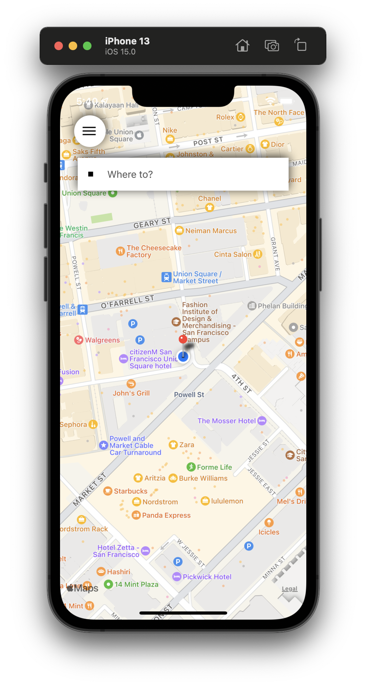
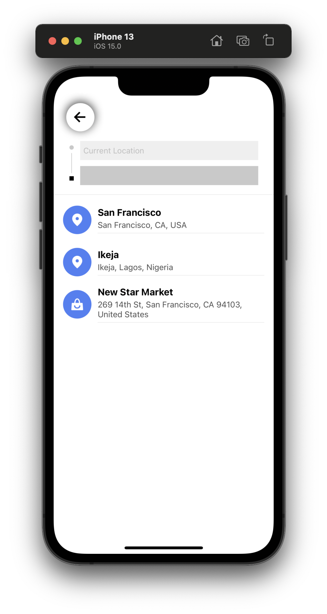
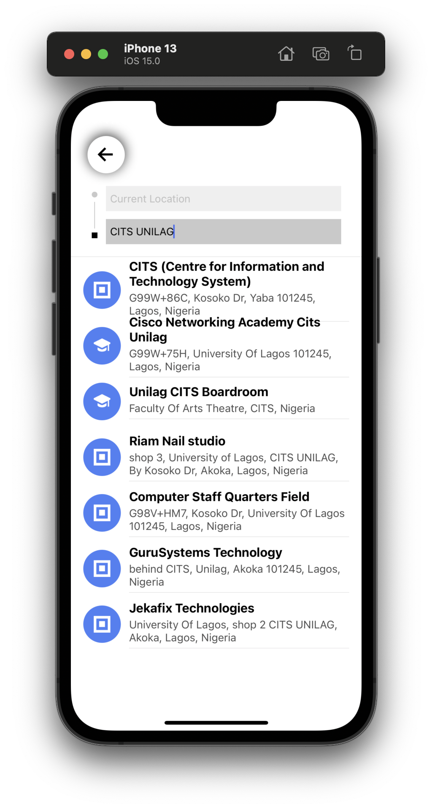
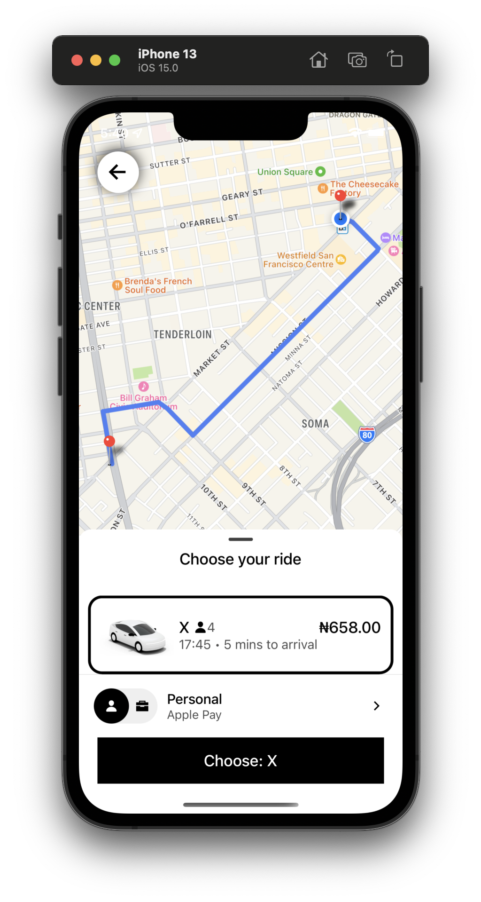

# Logistics App Project

This Logistics App project creation was built with the React Native and Expo framework with Google Maps API.
Changes are welcomed based on your requirements.

## Features:

- [x] Map View
- [x] Source geolocation calculation
- [x] Destination search
- [x] Shortest path to destination
- [x] Route view

## 📸 ScreenShots

|      |   |
|   |    |

## Prerequisites

Before running the Logistics App, make sure you have the following installed:

- Git Version Control: [https://git-scm.com/](https://git-scm.com/)
- Node (Package Manager): [https://nodejs.org/en](https://nodejs.org/en)
- Expo: [https://expo.dev](https://expo.dev)
- Android or iOS simulator

## Installation

**1. Create a folder where you want to save the project.**
**2. Clone this project**

```
$  git clone https://github.com/abionamike/logistics_app.git
```

Then, Enter the project

```
$  cd logistics_app
```
**3. Install all the dependencies.**<br/>
Command for npm:
   ```
   $ npm install
   ```
**4. Now, run your server**<br/>
Command for expo:
   ```
   $ npx expo start
   ```

## Usage
- Search your destination.

- Choose from the autocomplete dropdown.

- Navigate to your destination

## Support
For additional assistance using this library, contact the developer experience (DX) team via [email](mailto:amabiona21@gmail.com).

## Open to contribution ?

Yeah. Pull requests are welcomed.

## Having any issue using this ?

Please, let us know. Open up an issue.